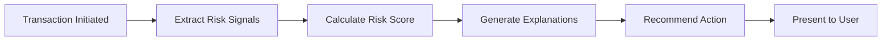
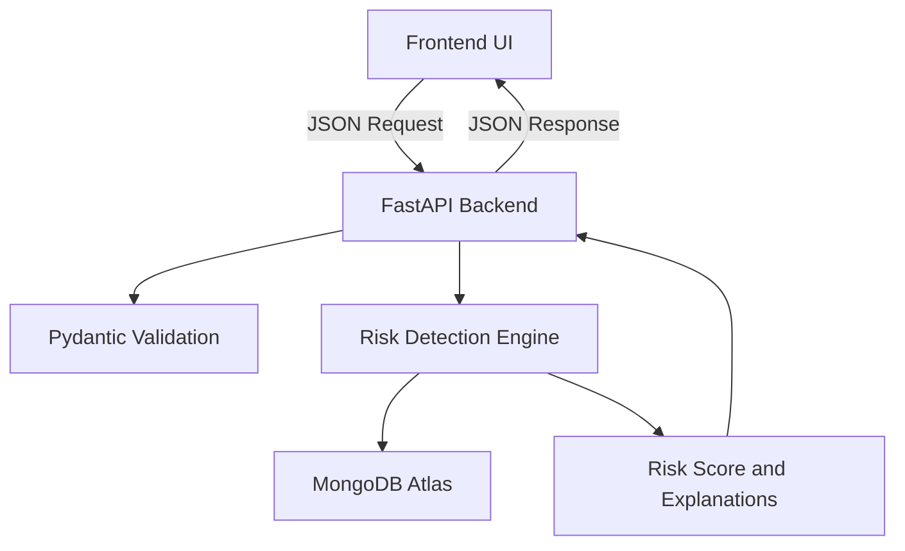

# 🛡️ FraudLens

### Explainable Real-Time Fraud Risk Detection for Digital Payments

🚧 **Current Status:** MVP implemented; prototype refinement and testing in progress

[](#)
[](#)
[](#)
[](#)
[](LICENSE)

FraudLens analyzes digital payment transactions in real time, identifies suspicious behavioral signals, calculates a transparent risk score, explicitly explains **why** a transaction was flagged, and provides actionable guidance to the user.

> **Don't just tell users that a transaction is risky. Explain WHY it is risky and WHAT they should do next.**

---

## 📑 Table of Contents

1. [Problem](#-problem)
2. [Our Solution](#-our-solution)
3. [Key Features](#-key-features)
4. [Product Workflow](#-product-workflow)
5. [System Architecture](#-system-architecture)
6. [Risk Detection Engine](#-risk-detection-engine)
7. [Technology Stack](#-technology-stack)
8. [Project Structure](#-project-structure)
9. [API Overview](#-api-overview)
10. [Getting Started](#-getting-started)
11. [Testing](#-testing)
12. [Demo & Screenshots](#-demo--screenshots)
13. [Current Scope & Limitations](#-current-scope--limitations)
14. [Security & Privacy](#-security--privacy)
15. [Future Scope](#-future-scope)
16. [Team](#-team)
17. [Hackathon Context](#-hackathon-context)
18. [Contribution / Team Workflow](#-contribution--team-workflow)

---

## 🛑 Problem

Digital payment fraud happens in seconds. Traditional security systems often issue generic, black-box warnings that leave users confused.

This can lead to:

- Alert fatigue
- Ignored warnings
- Poor understanding of transaction risk
- Delayed user intervention
- Potential financial loss

FraudLens focuses on making fraud detection **transparent, understandable, and actionable**.

| Traditional Fraud Alert | FraudLens |
|---|---|
| "Suspicious transaction" | Specific, transparent risk explanation |
| Little context | Behavioral and transaction context |
| User decides what to do alone | Recommended next action |
| Black-box feeling | Explainable, rule-based scoring |

---

## 💡 Our Solution

FraudLens shifts the approach from simply detecting suspicious transactions to **explaining the risk and guiding the user toward an appropriate action**.



The system evaluates transaction-level and behavioral signals, assigns transparent risk points, converts those signals into human-readable explanations, and recommends an appropriate next step.

---

## ✨ Key Features

### ⚡ Real-Time Transaction Analysis

Instant evaluation of payment payloads through a lightweight FastAPI backend.

### 📊 Behavioral & Velocity Signals

The prototype evaluates relevant indicators such as:

- New beneficiaries
- Unusual transaction amounts
- Device changes
- Multiple payment attempts
- Transaction velocity indicators where configured

### 🔍 Explainable Risk Scoring

Each detected signal contributes a clearly defined number of points to the overall risk score.

### 🗣️ Human-Readable Reasons

Technical fraud signals are converted into plain-language explanations that users can understand.

### 🚨 Actionable Recommendations

Instead of simply displaying a warning, FraudLens provides contextual guidance such as:

> **Verify Beneficiary**

### 🖥️ Interactive UI & Simulator

The frontend provides dashboard and transaction simulation views for demonstrating the fraud-analysis workflow in real time.

---

## 🔄 Product Workflow

### 1. Transaction Initiated

The user enters payment details or triggers a simulated transaction through the frontend.

### 2. Signal Extraction

The backend validates the transaction and retrieves relevant simulated user context from MongoDB where applicable.

### 3. Risk Scoring

The rule-based risk engine evaluates predefined fraud indicators and accumulates their corresponding risk points.

### 4. Risk Classification

The final score is classified into:

- **LOW**
- **MEDIUM**
- **HIGH**

### 5. Explanation Generation

Every triggered risk signal is converted into a plain-language explanation.

### 6. Recommended Action

The system generates contextual guidance based on the detected risk.

### 7. User Decision

The UI presents the score, detected signals, explanations, and recommended action so the user can make an informed decision.

---

## 🏗️ System Architecture



### Architecture Components

- **Frontend UI:** Captures simulated transaction inputs and displays risk analysis results.
- **FastAPI Backend:** Handles API routing, request validation, and backend orchestration.
- **Pydantic Validation:** Validates incoming transaction data.
- **Risk Detection Engine:** Evaluates predefined fraud rules and calculates the risk score.
- **MongoDB Atlas:** Stores simulated user profiles, transaction history, and behavioral data.
- **Risk Output:** Returns the risk score, detected signals, explanations, and recommended action to the frontend.


## ⚖️ Risk Detection Engine

FraudLens currently uses a **deterministic, rule-based risk engine** to prioritize transparency and explainability.

> **Note:** The risk weights below are prototype demonstration assumptions. They are NOT official banking, UPI, or financial-institution fraud thresholds.

| Signal | Score Contribution | Human-Readable Explanation |
|---|---:|---|
| **New Beneficiary** | +20 | This beneficiary is not in your usual payment history. |
| **Amount Anomaly** | +25 | This payment amount is significantly higher than your usual transaction pattern. |
| **Device Change** | +20 | This payment is coming from a device not previously associated with your activity. |
| **Multiple Attempts** | +15 | Multiple payment attempts were detected. |

### Risk Classification

The current prototype has a maximum possible score of **80** based on the four signals above.

| Score | Risk Level |
|---:|---|
| **0–30** | 🟢 LOW |
| **31–60** | 🟡 MEDIUM |
| **61–80** | 🔴 HIGH |

### Example

If a transaction triggers all four signals:

```text
New Beneficiary      +20
Amount Anomaly       +25
Device Change        +20
Multiple Attempts    +15
--------------------------------
Total Risk Score     80
```

The transaction is therefore classified as:

```text
Risk Level: HIGH
```

This deterministic approach makes every score traceable back to the signals that caused it.

---

## 💻 Technology Stack

| Layer | Technology | Purpose |
|---|---|---|
| **Frontend** | HTML5, CSS3, JavaScript | Interactive web interface, dashboard views, and transaction simulator |
| **Backend Framework** | Python, FastAPI, Uvicorn | API server, routing, validation, and backend orchestration |
| **Database** | MongoDB Atlas | Storage for simulated user profiles, transaction history, and behavioral data |
| **Database Driver** | PyMongo / Motor | Communication between the Python backend and MongoDB |
| **Risk Engine** | Python | Rule-based scoring and explanation generation |
| **Validation** | Pydantic | Request and response data validation |
| **Environment & Config** | python-dotenv | Environment-variable management |
| **Version Control** | Git, GitHub | Codebase management and version tracking |

---

## 📁 Project Structure

```text
FraudLens/
├── backend/
│   └── app/
│       ├── api/              # API routers and endpoints
│       ├── core/             # Database connectors and configurations
│       ├── schemas/          # Pydantic data schemas
│       ├── services/         # Fraud detection and risk scoring logic
│       ├── utils/            # Helper functions and utilities
│       └── main.py           # FastAPI application entry point
│
├── static/
│   ├── css/                  # Stylesheets
│   ├── js/                   # Frontend JavaScript
│   ├── buffer.html           # Processing/simulation screen
│   ├── index.html            # Main dashboard
│   ├── index2.html           # Risk analysis & transaction simulator
│   ├── index3.html           # User profile & behavioral view
│   └── index4.html           # Supplemental dashboard
│
├── .env.example              # Environment variables template
├── .gitignore                # Git ignore configuration
├── LICENSE                   # MIT License
├── README.md                 # Project documentation
├── main.py                   # Root application launcher
├── requirements.txt          # Python dependencies
├── seed_db.py                # MongoDB database seeder
├── seed_profile.py           # Profile and behavioral data seeder
└── test_mongodb.py           # MongoDB connection verification
```

---

## 🔌 API Overview

### `POST /api/transactions/analyze`

**Purpose:** Evaluates a transaction and returns a risk score, risk classification, explanations, and recommended action.

### Request Payload

```json
{
  "amount": 18500,
  "beneficiary_new": true,
  "device_changed": true,
  "failed_attempts": 2
}
```

### Response Payload

```json
{
  "risk_score": 80,
  "risk_level": "HIGH",
  "reasons": [
    {
      "signal": "new_beneficiary",
      "impact": 20,
      "message": "This beneficiary is not in your usual payment history."
    },
    {
      "signal": "amount_anomaly",
      "impact": 25,
      "message": "This payment amount is significantly higher than your usual transaction pattern."
    },
    {
      "signal": "device_changed",
      "impact": 20,
      "message": "This payment is coming from a device not previously associated with your activity."
    },
    {
      "signal": "multiple_attempts",
      "impact": 15,
      "message": "Multiple payment attempts were detected."
    }
  ],
  "recommended_action": "VERIFY",
  "recommended_message": "Verify the beneficiary before proceeding."
}
```

The response ensures that **every triggered signal contributing to the risk score is also explained to the user**.

---

## 🚀 Getting Started

### Prerequisites

- **Python:** 3.9+
- **MongoDB:** MongoDB Atlas account or local MongoDB instance
- **Git:** For cloning the repository

### 1. Clone the Repository

```bash
git clone https://github.com/ananyajoshi-cseai/FraudLens.git
cd FraudLens
```

### 2. Create a Virtual Environment

```bash
python -m venv venv
```

Activate it:

**Windows:**

```bash
venv\Scripts\activate
```

**macOS/Linux:**

```bash
source venv/bin/activate
```

### 3. Install Dependencies

```bash
pip install -r requirements.txt
```

### 4. Configure Environment Variables

Create a `.env` file based on `.env.example`.

Example:

```env
MONGODB_URI=your_mongodb_connection_string
DATABASE_NAME=fraudlens
```

> **Never commit real database credentials or secrets to GitHub.**

### 5. Seed the Database

If your prototype requires seeded demonstration data:

```bash
python seed_db.py
python seed_profile.py
```

### 6. Start the Backend

From the `backend/` directory:

```bash
uvicorn app.main:app --reload
```

The API will be available at:

```text
http://localhost:8000
```

Interactive API documentation:

```text
http://localhost:8000/docs
```

### 7. Open the Frontend

The frontend files are located in the `static/` directory.

If the FastAPI application is configured to serve the static directory, the frontend can be accessed through the FastAPI server.

Otherwise, open the relevant HTML page using the frontend serving method configured in the project.

---

## 🧪 Testing

### Implemented

- Risk engine score calculation
- Risk threshold classification
- Rule-trigger validation
- MongoDB connection verification

### Planned

- API endpoint validation tests
- Frontend integration tests
- End-to-end transaction simulation tests
- Additional edge-case testing

---

## 🎥 Demo & Screenshots

> 🚧 **Demo video coming soon.**

### Screenshots

Add screenshots of the following views before final submission:

- **Dashboard**
- **Analyze Payment**
- **Risk Result**
- **Transaction History**
- **User Profile / Behavioral Context**

Example:

```markdown

```

---

## 🚧 Current Scope & Limitations

FraudLens is currently a prototype designed for demonstration purposes.

### 1. Simulated Data

The prototype uses simulated transaction and behavioral data rather than live banking feeds.

### 2. No Live UPI Integration

FraudLens operates independently of real payment gateways and does not execute actual financial transactions.

### 3. Rule-Based Scoring

The current detection engine uses deterministic rules rather than a production-grade machine-learning fraud model.

### 4. Prototype Risk Weights

Risk weights are demonstration assumptions and are not derived from official banking or UPI fraud thresholds.

### 5. Limited Behavioral Baselines

The prototype does not yet establish highly personalized behavioral baselines for every individual user.

---

## 🔒 Security & Privacy

### Disclaimer

This prototype does **not** process real UPI PINs, banking passwords, authentication credentials, or sensitive banking information.

A production deployment would require additional security controls, including:

- End-to-End Encryption
- Secure Authentication & Authorization
- Tokenisation of sensitive credentials
- Strict Privacy Controls
- Audit Logging
- Secure API Communication
- Rate Limiting
- Fraud-model monitoring and validation

---

## 🔮 Future Scope

### 1. 🤖 ML-Based Anomaly Detection

Integrate machine-learning techniques such as anomaly detection once sufficient behavioral data is available.

### 2. 👤 Personalized Behavioral Baselines

Develop dynamic user-specific thresholds based on historical transaction behavior.

### 3. ⚡ Streaming Integration

Introduce real-time event-streaming infrastructure for high-volume transaction analysis.

### 4. 🏦 Bank / UPI Integration

Develop secure integration layers for use with authorized financial infrastructure.

### 5. 🧠 Adaptive Risk Scoring

Combine deterministic explainable rules with ML-generated signals while preserving human-readable explanations.

### 6. 📈 Continuous Risk Monitoring

Extend FraudLens from individual transaction analysis to continuous monitoring of suspicious behavioral patterns.

---

## 👥 Team

| Member | Role | Responsibilities |
|---|---|---|
| **Ananya** | Backend + GitHub | FastAPI architecture, Risk Engine, MongoDB, API routes & integration, repository management |
| **Anika** | Frontend | HTML, CSS, JavaScript UI, dashboard components, layout design, and risk-result states |
| **Adrija** | PPT + Product Story | Slide content, visual story, presentation documentation |
| **Aashi** | Demo + Support | Demo scenarios, presentation script, recording, and frontend support |

---

## 🏆 Hackathon Context

**Hackathon:** Build $ Bank  
**Track:** Track 2 — Fraud Detection & Financial Crime Prevention  
**Problem:** Problem 4 — Real-Time Fraud Explainer

FraudLens addresses the core challenge of real-time fraud explanation by providing a transparent intervention mechanism that builds user trust through **explanation rather than black-box blocking**.

The system demonstrates how fraud-risk detection can be made more understandable by connecting:

```text
Transaction
     ↓
Risk Signals
     ↓
Transparent Score
     ↓
Human-Readable Explanation
     ↓
Recommended Action
```

---

## 🤝 Contribution / Team Workflow

1. Pull the latest changes from `main`.

2. Create a new feature branch:

```bash
git checkout -b feature/<name>
```

3. Implement and test the changes locally.

4. Commit the changes:

```bash
git add .
git commit -m "Describe your change"
```

5. Push the feature branch:

```bash
git push origin feature/<name>
```

6. Open a Pull Request.

7. Review and merge after approval.

> **Note:** The `main` branch should remain stable and demo-ready at all times.

---

## 📌 Project Philosophy

FraudLens is built around three principles:

### 🔎 Detect

Identify suspicious transaction and behavioral signals.

### 💡 Explain

Show users exactly which signals contributed to the risk score.

### 🛡️ Protect

Provide clear guidance so users know what to do next.

---

# 🛡️ FraudLens

### Detect. Explain. Protect.
