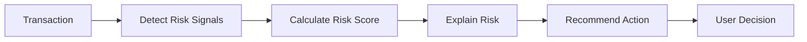
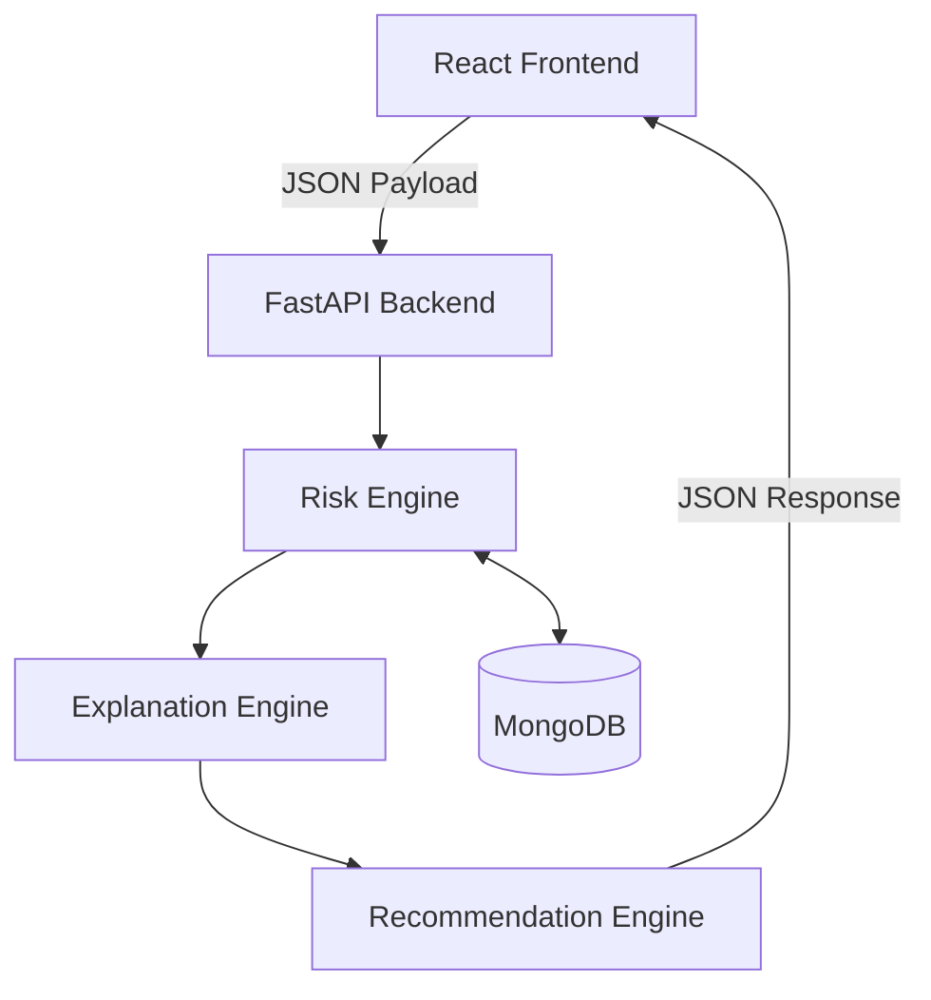

# 🛡️ FraudLens

### Explainable Real-Time Fraud Risk Detection for Digital Payments

🚧 **Current Status:** Prototype in Development

[](#)
[](#)
[](#)
[](#)

FraudLens analyzes digital payment transactions in real-time, identifies suspicious signals based on user behavior, calculates a transparent risk score, explicitly explains *why* a transaction was flagged, and guides the user toward an appropriate action. 

---

> **Don't just tell users that a transaction is risky. Explain WHY it is risky and WHAT they should do next..**

---

## 📑 Table of Contents

1. [Problem](#-problem)
2. [Our Solution](#-our-solution)
3. [Key Features](#-key-features)
4. [Product Workflow](#-product-workflow)
5. [System Architecture](#-system-architecture)
6. [Risk Detection Engine](#-risk-detection-engine)
7. [Technology Stack](#-technology-stack)
8. [Project Structure](#-project-structure)
9. [API Overview](#-api-overview)
10. [Getting Started](#-getting-started)
11. [Current Scope & Limitations](#-current-scope--limitations)
12. [Future Scope](#-future-scope)
13. [Team](#-team)
14. [Hackathon Context](#-hackathon-context)

---

## 🛑 Problem

Digital payment fraud happens in seconds. When existing systems flag a transaction, they typically issue a generic warning. This leaves users confused, leading to alert fatigue, ignored warnings, and ultimately, financial loss. 

| Traditional Fraud Alert | FraudLens |
|---|---|
| "Suspicious transaction" | Specific, transparent risk explanation |
| Little context | Behavioural/contextual signals displayed clearly |
| User decides what to do alone | Recommended, actionable guidance provided |
| Black-box feeling | Explainable, rule-based scoring |

---

## 💡 Our Solution

FraudLens shifts the paradigm from simple detection to user-centric explanation and guidance. 


## ✨ Key Features

*   **Real-time transaction analysis:** Instantaneous evaluation of payment payloads.
*   **Behaviour-based signals:** Compares current transactions against simulated user profiles.
*   **Explainable risk scoring:** Transparent point allocation for each flagged anomaly.
*   **Human-readable reasons:** Translates technical flags into plain-language explanations.
*   **Recommended actions:** Guides the user on how to proceed (e.g., "Verify Beneficiary").
*   **Demo/simulated scenarios:** Pre-built deterministic scenarios to demonstrate system behavior reliably.

---

## 🔄 Product Workflow

1. **Transaction Initiated:** User enters or selects a payment.
2. **Signal Extraction:** Backend compares data against the user's normal behavior.
3. **Risk Scoring:** Rules are evaluated and points are assigned.
4. **Risk Classification:** Score is bucketed into LOW, MEDIUM, or HIGH risk.
5. **Explanation Generation:** Human-readable reasons are mapped to triggered signals.
6. **Recommended Action:** A contextual next step is determined.
7. **User Decision:** The UI presents the findings clearly for user action.

---

## 🏗️ System Architecture


*   **React Frontend:** Captures simulated inputs and renders the explainable UI.
*   **FastAPI Backend:** Handles routing, validation, and orchestrates the risk analysis.
*   **Risk Engine:** Evaluates predefined rules against transaction data.
*   **MongoDB:** Stores simulated user profiles, transaction histories, and risk assessments.

---

## ⚖️ Risk Detection Engine

Our prototype uses a deterministic, rule-based risk engine to guarantee explainability. 

*Note: The risk weights below are prototype demonstration assumptions, NOT official banking or UPI fraud thresholds.*

| Signal | Score Contribution | Risk Classification | Human-Readable Explanation |
| :--- | :--- | :--- | :--- |
| **New Beneficiary** | +20 | **0–30:** LOW | "This beneficiary is not in your usual payment history." |
| **Amount Anomaly** | +25 | **31–60:** MEDIUM | "Amount is much higher than usual." |
| **Device Change** | +20 | **61–100:** HIGH | "Payment coming from a new device." |
| **Multiple Attempts** | +15 | | "Multiple attempts were made." |

### Risk Score Example

**Transaction:** ₹18,500 to Rahul Traders

*   New beneficiary: **+20**
*   Amount anomaly: **+25**
*   Device change: **+20**
*   Multiple attempts: **+15**
*   **Total Score:** **80 / 100 (HIGH RISK)**

---

## 💻 Technology Stack

| Layer | Technology | Purpose |
|---|---|---|
| **Frontend** | React, HTML/CSS, JS | User interface and state management |
| **Backend** | Python, FastAPI | API routing and business logic |
| **Risk Engine** | Python | Explainable rule-based scoring |
| **Database** | MongoDB | Data persistence |
| **Version Control**| Git, GitHub | Collaboration and CI/CD |

---

## 📁 Project Structure

```text
FraudLens/
├── backend/
│   ├── app/
│   │   ├── api/
│   │   ├── models/
│   │   ├── schemas/
│   │   └── services/
│   ├── tests/
│   ├── requirements.txt
│   └── .env.example
├── frontend/
│   ├── src/
│   ├── public/
│   └── package.json
├── docs/
├── .gitignore
├── README.md
└── LICENSE
```
## 🔌 API Overview

### `POST /api/transactions/analyze`

**Purpose:** Evaluates a transaction and returns a risk score with explanations.

**Request Payload:**
```json
{
  "amount": 18500,
  "beneficiary_new": true,
  "device_changed": true,
  "failed_attempts": 2
}
```

**Response Payload:**
```json
{
  "risk_score": 80,
  "risk_level": "HIGH",
  "reasons": [
    {
      "signal": "new_beneficiary",
      "impact": 20,
      "message": "This beneficiary is not in your usual payment history."
    },
    {
      "signal": "device_changed",
      "impact": 20,
      "message": "This payment is coming from a device not previously associated with your activity."
    }
  ],
  "recommended_action": "VERIFY",
  "recommended_message": "Verify the beneficiary before proceeding."
}
```
## 🚀 Getting Started

### Prerequisites
*   Python 3.10+
*   Node.js 18+ & npm
*   MongoDB (Local or Atlas)

### 1. Clone the Repository
```bash
git clone <repository-url>
cd FraudLens
```
### 2. Backend SetUp
```bash
cd backend
python -m venv venv

# Windows
venv\Scripts\activate
# Linux/macOS
source venv/bin/activate
```
### 3. Frontend Setup
```bash
cd ../frontend
npm install
pip install -r requirements.txt
```
## 🔐 Environment Variables

1. Navigate to the `backend/` directory.
2. Copy `.env.example` to `.env`:
   ```bash
   cp .env.example .env
   ```
3. Fill in your local configuration details (e.g., `MONGO_URI`, `PORT`).
4. **Never commit `.env` to version control.**

---

## ▶️ Running the Project

### 1. Start the Backend Server
From the `backend/` directory:
```bash
uvicorn app.main:app --reload
```
* **API Base URL:** `http://localhost:8000`
* **Interactive Swagger Docs:** `http://localhost:8000/docs`

### 2. Start the Frontend Application
From the `frontend/` directory:
```bash
npm start
```
* **Web App URL:** `http://localhost:8000`
## 🧪 Testing

Our testing strategy includes:
*   **Risk Engine Tests:** Validating score calculations and thresholds.
*   **API Tests:** Endpoint validation (Planned).
*   **Frontend Integration Tests:** Validating UI risk state rendering (Planned).

---

## 🎥 Demo & Screenshots

> 🚧 **Demo video coming soon.**

### Screenshots
*   **Dashboard:** `[ADD SCREENSHOT]`
*   **Analyze Payment:** `[ADD SCREENSHOT]`
*   **Risk Result:** `[ADD SCREENSHOT]`
*   **Transaction History:** 

---

## 🚧 Current Scope & Limitations

*   **Simulated Data:** Uses simulated transaction profiles, not live banking feeds.
*   **No Live UPI Integration:** Operates completely independent of real payment gateways.
*   **Rule-Based Scoring:** Relies on deterministic logic rather than a production-grade ML fraud model.
*   **Prototype Risk Weights:** Values are for demonstration, not derived from actuarial data.

---

## 🔮 Future Scope

1. **ML Anomaly Detection:** Implementing scikit-learn anomaly detection once baseline behavior is established.
2. **Personalized Baselines:** Dynamic thresholding based on individual user habits.
3. **Streaming Integration:** Real-time data pipeline support.
4. **Bank/UPI Integration:** Secure API bridges for live environment usage.

---

## 🔒 Security & Privacy

**Disclaimer:** This prototype does **not** process real UPI PINs, actual banking credentials, or sensitive financial information. 

A production deployment would require:
*   End-to-End Encryption
*   Secure Authentication & Authorization
*   Tokenisation of banking credentials
*   Strict Privacy Controls and Audit Logging

---

## 👥 Team

| Member | Role | Responsibilities |
|---|---|---|
| **Ananya** | Backend + GitHub | FastAPI architecture, Risk Engine, MongoDB, API routes |
| **Anika** | Frontend | React UI, components, API integration, risk result states |
| **Adrija** | PPT + Product Story | Slide content, visual story, presentation documentation |
| **Aashi** | Demo + Support | Demo scenarios, script, recording, frontend support |

---

## 🏆 Hackathon Context

**Hackathon:** Build $ Bank  
**Track 2:** Fraud Detection & Financial Crime Prevention  
**Problem 4:** Real-Time Fraud Explainer  

FraudLens addresses the core challenge of Problem 4 by providing a transparent, real-time intervention mechanism that builds user trust through explanation rather than black-box blocking.

---

## 🤝 Contribution / Team Workflow

1. Pull latest `main`.
2. Checkout a new `feature/<name>` branch.
3. Write code & test locally.
4. Open a Pull Request (PR).
5. Review & Merge.
*Note: `main` must remain stable at all times.*

---
*FraudLens - Detect. Explain. Protect.*
